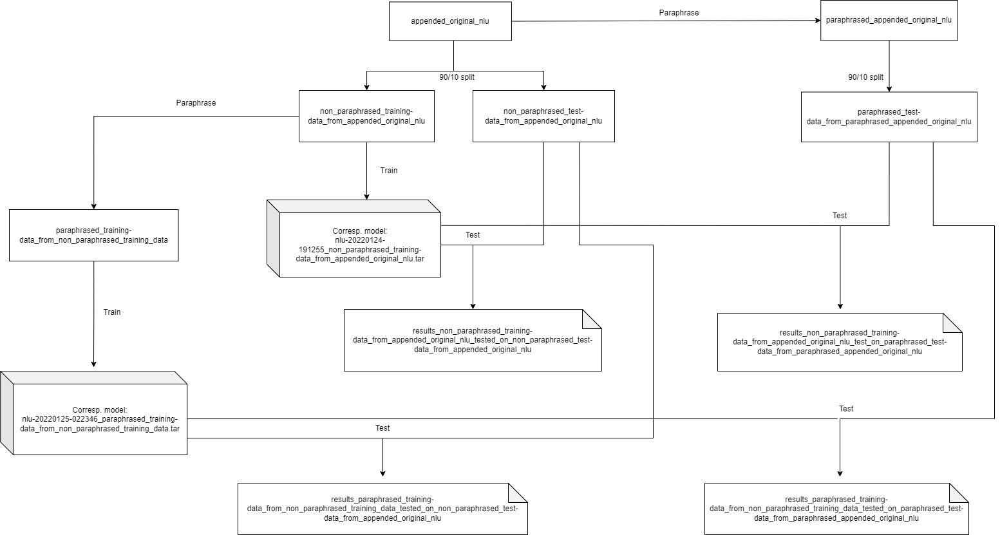

# CE7455 Project

Step by step instruction for how to run RASA NLU and Paraphraser to obtain results.

## Overview

Pretrained models can be found in the `models` folder.

The results of the various pretrained models are found in `results` folder.

`paraphraser.py` can be found in `paraphraser_tool` folder.

`AllYamlFiles` contains the necessary YAML files in RASA format. The RASA YAML format can be found in this [link](https://rasa.com/docs/rasa/nlu-training-data/).

## Command Line Interface

Refer to this [link](https://rasa.com/docs/rasa/command-line-interface/) for possible RASA commands.

## Instructions

### Install the dependencies
It is recommended to create a virtual environment with python version 3.7 and activate it before running the following:
```sh
pip install -r requirements.txt
```
Activate VirtualEnvironment in the folder

### Splitting Training and Test Data

1. split the training data into 90/10
```sh
$ rasa data split nlu --nlu data/nlu/appended_original_nlu.yml --training-fraction 9
```
2. rename the 10% test file to non_paraphrased_test_data_from_appended_original_nlu.yml

3. rename the 90% train file to non_paraphrased_training_data_from_appended_original_nlu.yml

### Training baseline RASA NLU Model

4. Train nlu model with non_paraphrased_training_data_from_appended_original_nlu.yml
```sh
$ rasa train --nlu --data data/nlu/non_paraphrased_training_data_from_appended_original_nlu.yml
```
### Performing Paraphrasing on Training Set

5. Paraphrase non_paraphrased_training_data_from_appended_original_nlu.yml by shifting the file to Pharaphraser folder, and convert it into XLSX format.
```sh
	a. Convert Yaml to XLSX by using: https://www.convertcsv.com/yaml-to-csv.htm 
	b. Update nlu_test.xlsx by importing the converted data.
	c. Run split.py to generate a new expanded.tsv file:
```
```sh
$ python split.py nlu_test.xlsx
```
```sh
e. Add "- " to nlu_examples_expanded by ="- "&<cell>
```
6. Run the paraphrasing python script.
```sh
$ python run paraphraser.py
```
7. Rename the resulting yaml file to paraphrased_training_data_from_non_paraphrased_training_data.yml
	
### Training RASA NLU Model with Paraphrased Training Dataset
	
8. Train nlu model with paraphrased_training_data_from_non_paraphrased_training_data.yml
```sh
$ rasa train --nlu --data data/nlu/paraphrased_test_data_from_paraphrased_appended_original_nlu.yml
```
### Performing Paraphrasing on Test Set
	
9. Paraphrase appended_original_nlu.yml by shifting the file to Paraphraser folder, and converting it into XLSX format.
```sh
	a. Convert Yaml to XLSX by using: https://www.convertcsv.com/yaml-to-csv.htm 
	b. Update nlu_test.xlsx by importing the converted data.
	c. Run split.py to generate a new expanded.tsv file:
```
```sh
$ python split.py nlu_test.xlsx
```
```sh
e. Add "- " to nlu_examples_expanded by ="- "&<cell>
```
10. Run the paraphrasing python script.
```sh
$ python run paraphraser.py
```
11. Rename the resulting yaml file to paraphrased_appended_original_nlu.yml

12. Split the training data into 90/10
```
$ rasa data split nlu --nlu data/nlu/appended_original_nlu.yml --training-fraction 9
```
13. Rename the 10% test file to paraphrased_test_data_from_paraphrased_appended_original_nlu.yml
	
### Training and Testing remaining model permutations

14. Test the model created in step 4. with non_paraphrased_test_data_from_appended_original_nlu.yml
```sh
$ rasa test nlu --nlu data/nlu/non_paraphrased_test_data_from_appended_original_nlu.yml --model model/<auto-generated-model-name-from-step-4.tar>
```
15. Test the model created in step 4. with paraphrased_test_data_from_paraphrased_appended_original_nlu.yml
```sh
$ rasa test nlu --nlu data/nlu/paraphrased_test_data_from_paraphrased_appended_original_nlu.yml --model model/<auto-generated-model-name-from-step-4.tar>
```
16. Test the model created in step 8. with non_paraphrased_test_data_from_appended_original_nlu.yml
```sh
$ rasa test nlu --nlu data/nlu/non_paraphrased_test_data_from_appended_original_nlu.yml --model model/<auto-generated-model-name-from-step-8.tar>
```
17. Test the model created in step 8. with paraphrased_test_data_from_paraphrased_appended_original_nlu.yml
```sh
$ rasa test nlu --nlu data/nlu/paraphrased_test_data_from_paraphrased_appended_original_nlu.yml --model model/<auto-generated-model-name-from-step-8.tar>
```

The overview of training and test permutations can be seen in the following diagram:



## Results

After performing testing, the results can be found in `results` folder. 

###
The performance of the model can be found under the `intent_report.json` file at the bottom of the json file.

For example:

```sh
"accuracy": 0.8537735849056604,
  "macro avg": {
    "precision": 0.801493710691824,
    "recall": 0.8537735849056604,
    "f1-score": 0.8179245283018868,
    "support": 212
  },
  "weighted avg": {
    "precision": 0.801493710691824,
    "recall": 0.8537735849056604,
    "f1-score": 0.8179245283018868,
    "support": 212
  }
```

### Performance Visualisatioin
Additionally, the confusion matrix and confidence distribution histograms are automaticall generated. For instance:


